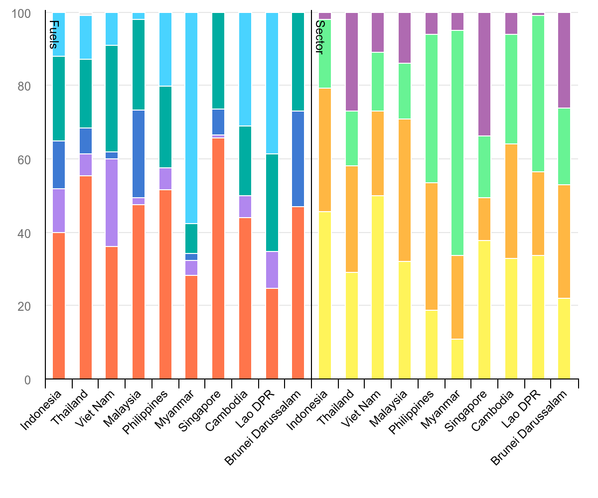

```{r}
#| include: false
# Global setup chunk for libraries, options, and shared objects.
```
##Team Introduction
Group 2 Members:
Lim Ze Kai
Ziven Wang
Tan Jing Yu
Ivan Tan
Jaison Tan


## Project Overview
After initial general research across ASEAN countries, we narrowed down on energy visualizations as they a often poorly represented.

Our presentation documents a critique and improvement of an existing visualization of Southeast Asia's energy consumption.


## Project Objectives

**First**, how does fuel consumption and their type vary across the different ASEAN nations?

**Second**, are there meaningful structural differences in how energy is used across sectors that aggregate regional narratives conceal?

**Third**, does the relationship between a country's primary fuel source and its dominant end-use sector support or challenge the narrative that developing, agrarian-industrial economies face fundamentally different inflationary energy risks than hyper-dense, import-dependent commercial hubs?

## Data Context {.smaller}

- Source dataset: `data/energy_data.csv`
- Scope: Southeast Asia, 2024
- Structure: long-format data with country, fuel type, end-use sector, percentage, and panel fields
- **Important note: due to data quality issues at the source (e.g. inconsistent country naming conventions such as "Lao DPR" and "Viet Nam"), the original data could not be used as-is. We therefore built a structurally faithful synthetic proxy dataset that mirrors the real structure and distributions for this project.**

## Existing Chart {.smaller}

{width="85%" fig-align="center"}

- Dual-panel 100% stacked bars: fuel mix and end-use sector mix across ASEAN.
- Values are normalized to 100% for each country and panel.

## Existing Chart: Strengths & Weaknesses {.smaller}

::: {.columns}

::: {.column width="48%"}

### Strengths

- Compact regional overview.
- Dual-panel layout links fuel and sector composition.
- Part-to-whole scale supports comparative reading.

:::

::: {.column width="48%"}

### Weaknesses

- No on-chart legend, so colors cannot be decoded without source metadata.
- Two category systems (fuel and sector) raise cognitive load.
- Percentage-only values hide absolute energy scale differences.
- Mid-stack segment comparisons are hard.
- Heavy color dependence reduces accessibility.

:::

:::

## Critical Analysis - What Works

- **S1:** Compact regional overview across all ten ASEAN countries
- **S2:** Useful dual-panel structure linking fuel mix and end-use sector mix
- **S3:** 100% stacked format supports proportional comparison

**Key message:** the original chart is useful as a broad regional overview, but it has limitations for detailed comparison.

## Critical Analysis - Key Weaknesses

<table>
  <colgroup>
    <col style="width: 22%;">
    <col style="width: 78%;">
  </colgroup>
  <thead>
    <tr>
      <th>Weakness</th>
      <th>How it affects interpretation</th>
    </tr>
  </thead>
  <tbody>
    <tr><td>W1-W2</td><td>Two category systems increase mental switching and reduce segment-level comparability.</td></tr>
    <tr><td>W3</td><td>Percentage-only values hide total energy scale and may overstate small countries.</td></tr>
    <tr><td>W4</td><td>Color decoding dominates, which hurts accessibility and speed.</td></tr>
    <tr><td>W5-W6</td><td>Weak ordering and annotation make targeted country comparisons harder.</td></tr>
  </tbody>
</table>

## Proposed Improvements

| Weakness | Improvement |
|---|---|
| W1 | Clearer separation of fuel and sector panels |
| W2 | Horizontal layout or aligned comparison design |
| W3 | Data note explaining the percentage-only limitation |
| W4 | Colourblind-safe palette and cleaner legend |
| W5 | Selective annotations and callouts |
| W6 | Sort countries by a meaningful analytical metric |

## Redesign Direction

<div style="font-size: 95%;">

- Keep the original chart's regional comparison purpose.
- Preserve the dual analytical lens: fuel mix and end-use sector.
- Improve readability using aligned panels or a horizontal structure.
- Improve accessibility through better colour and labelling.
- Improve storytelling using annotations and meaningful ordering.
- Include a caption noting that the chart is based on a structurally faithful synthetic proxy of the original IEA visualization.

</div>

## Analysis Plan

<div style="font-size: 95%;">

- Summarize the fuel mix and end-use sector mix for each ASEAN country using the percentage shares in the dataset, and identify the dominant categories in each case.
- Compare countries by fossil-fuel reliance, low-carbon share, and sector concentration in industry, transport, and buildings, while validating that each country-dimension pair sums to 100%.
- Address key questions: which countries are most dependent on oil and transport, which are more industry-driven or building-driven, and whether stronger fossil-fuel reliance is linked to greater exposure to energy price shocks.

</div>

## Reproducible Workflow {.smaller}

::: {.columns}

::: {.column width="42%"}

- Load from `data/energy_data.csv` using a project-relative path for portability.
- Normalize country names, coerce numeric percentages, and set factor levels for stable ordering.
- Derive indicator-ready metrics (for example, fossil share and industry/consumer-demand shares).
- Generate plots from this single cleaned object, then render directly to `presentation.qmd`.

:::

::: {.column width="58%"}

```{r}
#| label: workflow-prepare
#| echo: true
#| eval: true
#| message: false
#| warning: false
#| results: "hide"
energy_data <- readr::read_csv(
  file.path("data", "energy_data.csv"),
  show_col_types = FALSE
) |>
  dplyr::mutate(
    Country = stringr::str_squish(Country),
    Percentage = as.numeric(Percentage),
    Dimension = factor(Dimension, levels = c("Fuel", "Sector")),
    Country = factor(
      Country,
      levels = c(
        "Brunei Darussalam", "Cambodia", "Indonesia", "Lao DPR",
        "Malaysia", "Myanmar", "Philippines", "Singapore", "Thailand", "Viet Nam"
      )
    )
  )

energy_summary <- energy_data |>
  dplyr::mutate(
    fuel_fossil = ifelse(Dimension == "Fuel" & Category %in% c("Oil", "Coal", "Natural Gas"), Percentage, 0),
    sector_consumer = ifelse(Dimension == "Sector" & Category %in% c("Transport", "Buildings"), Percentage, 0)
  )
```

:::

:::

## Reproducibility {.smaller}

::: {.columns}

::: {.column width="42%"}

- Checks are coded to fail fast: missing values, bounds, duplicate rows, and composition sums.
- Each `(Country, Dimension)` pair must sum to `100 +/- 0.01`.
- Render commands are fixed: `quarto preview presentation.qmd` and `quarto render presentation.qmd` from repo root.

:::

::: {.column width="58%"}

```{r}
#| label: workflow-checks
#| echo: true
#| eval: true
#| message: false
#| warning: false
#| results: "hide"
required_cols <- c("Country", "Dimension", "Category", "Percentage")
stopifnot(all(required_cols %in% names(energy_data)))
stopifnot(all(!is.na(energy_data$Country)), all(!is.na(energy_data$Dimension)), all(!is.na(energy_data$Category)), all(!is.na(energy_data$Percentage)))
stopifnot(all(energy_data$Percentage >= 0), all(energy_data$Percentage <= 100))
stopifnot(nrow(energy_data |> dplyr::count(Country, Dimension, Category) |> dplyr::filter(n > 1)) == 0)

composition_check <- energy_data |>
  dplyr::group_by(Country, Dimension) |>
  dplyr::summarise(total_pct = sum(Percentage, na.rm = TRUE), .groups = "drop")

stopifnot(all(abs(composition_check$total_pct - 100) <= 1e-2))
sessionInfo()
```

:::

:::

## Final Data Code {.smaller}

::: {.columns}

::: {.column width="42%"}

<div style="font-size: 90%;">

Applying the analysis workflow with readable structure:

- Prepare data and validate structure.
- Derive country-level indicators (fossil dependence, sector concentration).
- Build a compact ranking table and a vulnerability metric.
- Render final outputs for presentation review.

</div>

::: 

::: {.column width="58%"}

```{r}
#| label: final-data-code
#| eval: false
#| echo: true
#| message: false
#| warning: false

# prepare Energy data
energy_data <- prepare_energy_data(...)

# aggregate metrics
analysis_metrics <- energy_data |>
  dplyr::group_by(...) |>
  dplyr::summarise(...)

# compute top categories
fuel_top <- energy_data |>
  dplyr::filter(Dimension == "Fuel") |>
  dplyr::group_by(...) |>
  dplyr::summarise(...) |>
  dplyr::slice_max(...) |>
  dplyr::transmute(...)

sector_top <- energy_data |>
  dplyr::filter(Dimension == "Sector") |>
  dplyr::group_by(...) |>
  dplyr::summarise(...) |>
  dplyr::slice_max(...) |>
  dplyr::transmute(...)

analysis_summary <- analysis_metrics |>
  dplyr::left_join(fuel_top, by = "Country") |>
  dplyr::left_join(sector_top, by = "Country")

# render summary table + chart
knitr::kable(...)
ggplot2::ggplot(...) + ...
```

:::

:::

## Final Data Chart {.smaller}

::: {.columns}

::: {.column width="42%"}

<div style="font-size: 88%;">

Final outputs from the analysis pipeline:

- Ranked countries by dominant fuel and sector pressure.
- Dominant fuel share, dominant sector share, and derived vulnerability.
- Plot ranks by the combined vulnerability index.

</div>

::: 

::: {.column width="58%"}

```{r}
#| label: final-analysis-metrics
#| echo: false
#| eval: true

prepare_energy_data <- function(filepath = file.path("data", "energy_data.csv")) {
  d <- readr::read_csv(filepath, show_col_types = FALSE)
  dplyr::mutate(
    d,
    Country = stringr::str_squish(Country),
    Category = stringr::str_squish(Category),
    Dimension = stringr::str_squish(Dimension),
    Percentage = as.numeric(Percentage),
    Dimension = factor(Dimension, levels = c("Fuel", "Sector"))
  )
}

if (!exists("energy_data")) {
  energy_data <- prepare_energy_data()
}

energy_data <- prepare_energy_data() |>
  dplyr::mutate(
    Country = as.character(Country),
    Country = factor(
      Country,
      levels = c(
        "Brunei Darussalam", "Cambodia", "Indonesia", "Lao DPR",
        "Malaysia", "Myanmar", "Philippines", "Singapore", "Thailand", "Viet Nam"
      )
    )
  )

analysis_metrics <- energy_data |>
  dplyr::group_by(Country) |>
  dplyr::summarise(
    oil_share = sum(Percentage[Dimension == "Fuel" & Category == "Oil"], na.rm = TRUE),
    fossil_share = sum(Percentage[Dimension == "Fuel" & Category %in% c("Oil", "Coal", "Natural Gas")], na.rm = TRUE),
    electricity_share = sum(Percentage[Dimension == "Fuel" & Category == "Electricity"], na.rm = TRUE),
    industry_share = sum(Percentage[Dimension == "Sector" & Category == "Industry"], na.rm = TRUE),
    transport_share = sum(Percentage[Dimension == "Sector" & Category == "Transport"], na.rm = TRUE),
    buildings_share = sum(Percentage[Dimension == "Sector" & Category == "Buildings"], na.rm = TRUE),
    .groups = "drop"
  ) |>
  dplyr::mutate(
    consumer_overhead_share = transport_share + buildings_share,
    vulnerability_index = round((oil_share * consumer_overhead_share) / 100, 1)
  )

fuel_top <- energy_data |>
  dplyr::filter(Dimension == "Fuel") |>
  dplyr::group_by(Country, Category) |>
  dplyr::summarise(share = sum(Percentage), .groups = "drop") |>
  dplyr::slice_max(order_by = share, n = 1, with_ties = FALSE) |>
  dplyr::transmute(
    Country = Country,
    dominant_fuel = as.character(Category),
    dominant_fuel_share = share
  )

sector_top <- energy_data |>
  dplyr::filter(Dimension == "Sector") |>
  dplyr::group_by(Country, Category) |>
  dplyr::summarise(share = sum(Percentage), .groups = "drop") |>
  dplyr::slice_max(order_by = share, n = 1, with_ties = FALSE) |>
  dplyr::transmute(
    Country = Country,
    dominant_sector = as.character(Category),
    dominant_sector_share = share
  )

analysis_summary <- analysis_metrics |>
  dplyr::left_join(fuel_top, by = "Country") |>
  dplyr::left_join(sector_top, by = "Country")

if (!"dominant_fuel_share" %in% names(analysis_summary)) {
  analysis_summary$dominant_fuel_share <- NA_real_
}
if (!"dominant_sector_share" %in% names(analysis_summary)) {
  analysis_summary$dominant_sector_share <- NA_real_
}
if (!"dominant_fuel" %in% names(analysis_summary)) {
  analysis_summary$dominant_fuel <- NA_character_
}
if (!"dominant_sector" %in% names(analysis_summary)) {
  analysis_summary$dominant_sector <- NA_character_
}

analysis_summary <- analysis_summary[order(-analysis_summary$vulnerability_index), ]

analysis_summary_table <- data.frame(
  Country = as.character(analysis_summary$Country),
  Dominant_Fuel = ifelse(is.na(analysis_summary$dominant_fuel), "N/A", analysis_summary$dominant_fuel),
  Fuel_Share = round(dplyr::coalesce(as.numeric(analysis_summary$dominant_fuel_share), 0), 1),
  Dominant_Sector = ifelse(is.na(analysis_summary$dominant_sector), "N/A", analysis_summary$dominant_sector),
  Sector_Share = round(dplyr::coalesce(as.numeric(analysis_summary$dominant_sector_share), 0), 1),
  Fossil_Share = round(analysis_summary$fossil_share, 1),
  Transport_Buildings = round(analysis_summary$consumer_overhead_share, 1),
  Vulnerability = analysis_summary$vulnerability_index,
  stringsAsFactors = FALSE
)

colnames(analysis_summary_table) <- c(
  "Country",
  "Dominant Fuel",
  "Fuel Share (%)",
  "Dominant Sector",
  "Sector Share (%)",
  "Fossil Share (%)",
  "Transport + Buildings (%)",
  "Vulnerability"
)

knitr::kable(
  head(analysis_summary_table, 8),
  caption = "Leading countries by fuel dependency, demand pressure, and derived vulnerability",
  digits = 1
)
```
```{r}
#| label: final-vulnerability-plot
#| echo: false
#| fig-width: 9
#| fig-height: 5
#| dev: png
plot_data <- analysis_summary |>
  dplyr::arrange(vulnerability_index) |>
  dplyr::mutate(Country = factor(Country, levels = Country))

ggplot2::ggplot(plot_data, ggplot2::aes(x = Country, y = vulnerability_index)) +
  ggplot2::geom_col(fill = "#1b9e77") +
  ggplot2::coord_flip() +
  ggplot2::labs(
    title = "Vulnerability Index by Country",
    subtitle = "Oil share × (Transport + Buildings) / 100",
    x = NULL,
    y = "Vulnerability index"
  ) +
  ggplot2::theme_minimal(base_size = 12)
```

:::

:::

## Thank You

Thank you for your time.
