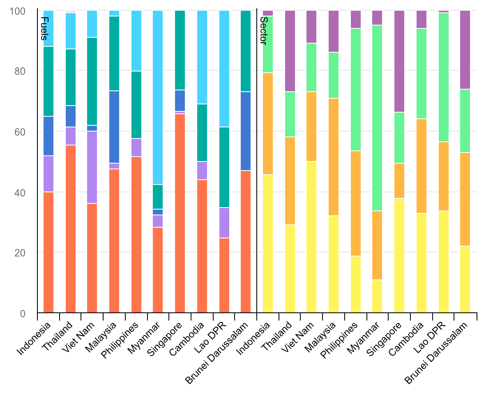

# 1. Introduction and Project Overview

## 1.1 Our Project’s Aim

Southeast Asia’s rapid economic development has triggered a profound transformation in its regional energy landscape over the past few decades. Rising energy costs, volatile fuel markets, and changing post-COVID grid demands now sit at the center of intense public and macroeconomic debates, as member nations struggle to balance aggressive industrial growth, urban expansion, and household cost-of-living stability. However, aggregate regional statistics often obscure the vast structural disparities and distinct economic vulnerabilities built into each nation's unique energy framework.

Our project seeks to answer three interrelated questions using the International Energy Agency’s (IEA) 2024 final energy consumption data for Southeast Asia.

**First**, how do final energy consumption mixes by fuel type actually vary across the different ASEAN nations, and what do these distinct portfolios reveal about each country's baseline resource dependencies?

**Second**, are there meaningful structural disparities in how energy demand is distributed across end-use sectors that aggregate regional narratives conceal? The original visualization attempts to depict both fuel types and sector demands simultaneously, but its crowded layout, uniform column spacing, and ambiguous visual proximity make it incredibly difficult to isolate and evaluate these two separate dimensions.

**Third**, does the relationship between a country's primary fuel reliance and its dominant end-use sector support or challenge the narrative that developing, agrarian-industrial economies face fundamentally different inflationary energy risks than hyper-dense, import-dependent commercial hubs?

Our improved chart aims to answer all three questions in a single visualization by encoding four dimensions simultaneously: country, data dimension (fuel profile vs. sector demand), consumption category, and percentage share. The redesign moves beyond the original chart’s cluttered, ambiguous layout to offer a clean, side-by-side comparative architecture. This framework reveals exactly where regional energy vulnerabilities are concentrated, how national fuel portfolios align with sectoral demands, and how diverse the structural economic pressures truly are across the holistic Southeast Asian landscape.

## 1.2 Source & Context

The original visualization/data was sourced from **International Energy Agency** in a publication titled *“Southeast Asia Energy Outlook 2026”* (June 2026), available at:

> https://www.iea.org/reports/southeast-asia-energy-outlook-2026/energy-in-southeast-asia



Source: International Energy Agency, *Southeast Asia Energy Outlook 2026*, June 2026.

### 1.2.1 Original Chart's Structure & Design
The visualization under review is a dual-panel, 100% stacked column chart titled “Total final consumption mix by fuel and end-use sector in Southeast Asia, 2024”. The graphic functions as a comparative profile matrix, mapping the Total Final Consumption (TFC) of energy across the ten ASEAN member states. It breaks down the region's energy architecture simultaneously across three core dimensions:

- Geographic Entity (X-Axis): Ten Southeast Asian nations arranged in an identical left-to-right sequence across both panels to facilitate parallel visual scanning.

- Energy Supply Portfolio (Left Panel - "Fuels"): Compares the relative share of primary energy carriers fueling each economy, including Oil, Natural Gas, Coal, Bioenergy, and Electricity.

- Sectoral Demand Profile (Right Panel - "Sector"): Tracks the final destination of that consumed energy across functional economic sectors, categorized into Industry, Transport, Buildings, and Other.

The chart is divided into two distinct, horizontally juxtaposed panels sharing a unified vertical scale (0% to 100%). This layout relies on normalized part-to-whole configurations rather than absolute volumetric measurements.

By scaling all bars to an equal 100% height, the design prioritizes structural composition over absolute scale. This allows the viewer to evaluate the systemic "DNA" of each country's energy economy, regardless of whether they are comparing a massive market like Indonesia to a smaller one like Brunei.

### 1.2.2 The Story it Tells
The visualization dismantles the notion of a monolithic Southeast Asian energy landscape, illustrating instead a region sharply divided by economic maturity, urban density, and industrial architecture. Several distinct narratives emerge from the structural composition of the bars:

1. **The Shared Anchor of Petroleum:** Across almost all ASEAN nations, Oil (represented by the dominant coral base on the left panel) serves as the single largest bedrock fuel. This visual weight directly correlates with the Transport sector (orange blocks on the right panel), showing that despite varying levels of economic development, the region remains locked into liquid fossil fuel dependency to move goods and people.

2. **The Agrarian-to-Urban Development Divide:** A stark contrast appears when tracking Bioenergy (teal bands) against Electricity (light blue bands). Developing or resource-rich continental economies like Viet Nam, Cambodia, and Lao DPR display large blocks of bioenergy, often used for traditional building or residential heating and cooking. Conversely, highly urbanized, industrialized, or island economies like Singapore, Malaysia, and Brunei show virtually zero bioenergy reliance, replacing it entirely with centralized Electricity and Natural Gas.

3. **Diverse Sectoral Engines:** The right panel exposes fundamentally different economic drivers across the region. Viet Nam and Indonesia stand out as industrial heavyweights, with their yellow "Industry" bars consuming nearly half of their total energy footprint. In contrast, Myanmar exhibits a building-centric profile, where its massive green block reveals that the residential and commercial building footprint dwarfs its industrial and transport sectors combined.

4. **The Exogenous Shock Vulnerability Matrix:** By reading the panels in parallel, the visualization tells a story of systemic risk. Nations displaying a simultaneous combination of high oil dependence (left) and massive transport/building sector exposure (right) are revealed to be highly vulnerable to external supply chain disruptions. Because their energy is spent on daily domestic survival and basic mobility rather than flexible industrial output, global energy price shocks translate directly into immediate domestic cost-of-living inflation.


------------------------------------------------------------------------

# 2. Data Overview & Quality

## 2.1 Raw Data Structure 1

The first data source does not follow a simple rectangular table structure. It uses a **multi-block layout** where each category occupies a separate vertical block of rows, preceded by several metadata rows. The structure is generally as follows:

- **Rows 1-6:** Metadata and headers (to be skipped)
- **Row 7:** Column headers / Year markers
- **Rows 8+:** Data blocks separated by category headers

\[Insert specific details about how the first data source is formatted and how it should be parsed.\]

## 2.2 Raw Data Structure 2

The second data source follows a similar multi-block convention but introduces additional complexity: the **sub-categories appear as column headers** (rather than rows), making it a two-dimensional table within each primary block.

- **Rows 1-6:** Metadata and headers (to be skipped)
- **Row 7:** Sub-category column headers
- **Rows 8+:** Data blocks separated by primary category headers

\[Insert specific details about how the second data source is formatted.\]

## 2.3 Identified Data Quality Challenges

Below is a summary of the data quality challenges identified during the initial data inspection, along with the planned mitigation strategies.

| ID | Issue Description | Severity | Planned Decision / Mitigation |
|----|----|----|----|
| **C1** | \[Describe challenge 1, e.g., missing column markers\] | High | \[Describe mitigation, e.g., Extract blocks independently using known start rows\] |
| **C2** | \[Describe challenge 2, e.g., inconsistent date formats\] | Medium | \[Describe mitigation, e.g., Standardize using `lubridate`\] |
| **C3** | \[Describe challenge 3, e.g., hidden aggregate rows\] | Low | \[Describe mitigation, e.g., Filter out rows containing 'Total' in label column\] |

------------------------------------------------------------------------

# 3. Data Pipeline & Reproducibility

## 3.1 Illustrative Code Structure

The final pipeline code will follow the structure below. This demonstrates the planned function signatures and data flow.

**Code Block: Data Extraction Helper Function** *This block should contain the named helper function used to extract and parse the raw data from the source files, utilizing specific row offsets and column indices.*

```{r}
# Insert extraction function here
# Example: extract_data() 
# args: raw sheet, start row, category label, col index
```

**Code Block: Data Aggregation and Summary** *This block should contain the code that aggregates the extracted tidy data into the final summary format required for the visualizations (e.g., creating the 24-row summary for chart labels).*

```{r}
# Insert aggregation/summary code here
# Example: summary_data <- ... 
```

**Code Block: Visualization / Plotting** *This block should contain the `ggplot2` (or equivalent) code used to generate the final visual outputs, including theme customizations and scale adjustments.*

```{r}
# Insert plotting code here
```

## 3.2 Reproducibility Considerations

To ensure the project is fully reproducible, the following standards are implemented:

- **📁 File Structure:** All raw source files are stored in a `datasets/` subfolder within the project root. File paths are resolved programmatically relative to the `.qmd` document's directory (e.g., using `here::here()`), ensuring no absolute paths are hard-coded.
- **📦 Package Management:** All required packages are loaded at the top of the pipeline in a single block. Package versions are captured using `sessionInfo()` at the end of the document.
- **🔒 Source File Integrity:** All row offsets and column indices derived from visual inspection are stored as named constants in a dedicated setup block. No "magic numbers" appear inside extraction functions.
- **✅ Built-in Assertions:** The pipeline requires no internet connection or external API calls. All data is loaded locally. Assertions are used to verify row counts and column types at each stage of the pipeline.

------------------------------------------------------------------------

# 4. Data Analysis Plan

\[Insert the step-by-step methodology for the data analysis. This should include:\] 1. **\[Step 1 Name\]:** \[Description of the first analytical step\] 2. **\[Step 2 Name\]:** \[Description of the second analytical step\] 3. **\[Step 3 Name\]:** \[Description of the third analytical step\]

------------------------------------------------------------------------

# 5. References & Sources

## 5.1 Article Source

- \[Author/Organization\]. (\[Year\]). *\[Article Title\]*. Retrieved from \[URL\]

## 5.2 Data Sources

- \[Dataset Name 1\], \[Publisher/Source\], \[Year\].
- \[Dataset Name 2\], \[Publisher/Source\], \[Year\].

## 5.3 Design Reference

- \[Reference to any design inspiration, color palettes (e.g., colorblind-safe palettes), or UI/UX guidelines used in the project\].

------------------------------------------------------------------------

# 6. Appendix: Data Dictionary

| Column | Data Type | Source | Unit / Range | Role in Analysis |
|----|----|----|----|----|
| `var_1` | `factor` | Source 1 | \[e.g., 12 levels\] | \[e.g., Y-axis position\] |
| `var_2` | `factor` | Source 1 & 2 | \[e.g., 2 levels\] | \[e.g., Color grouping\] |
| `var_3` | `numeric` | Source 2 | \[e.g., 0.0 - 100.0\] | \[e.g., X-axis value\] |
| `var_4` | `date` | Source 1 | \[e.g., 2014 - 2024\] | \[e.g., Time series filtering\] |
